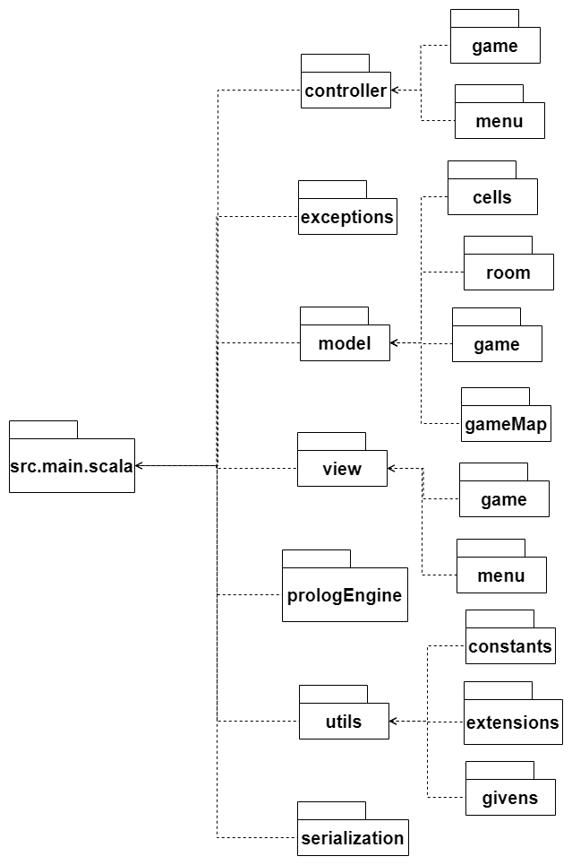

# Design di dettaglio

## Tecnologie utilizzate

- **TuProlog:** framework per la programmazione logica, utilizzato al fine di implementare e utilizzare regole in Prolog 
- **Swing:** framework utilizzato per lo sviluppo dell'interfaccia grafica.
- **Circe:** libreria utilizzata per la serializzazione e deserializzazione dei file in formato Json.

## Diagramma dei package
In seguito viene presentato il diagramma dei package fino al secondo livello.
I package principali sono model, view e controller che riflettono la struttura architetturale del progetto; ma sono anche
presenti i package exceptions che modella le eccezioni specifiche del sistema, prologEngine per l'esecuzione di codie prolog e
utils per i metodi e le costanti comuni alle varie sezioni del progetto.

<p align="center">
  
<caption>Diagramma dei package</caption>
</p>

## Model

### Cell
```Cell``` rappresenta una singola cella caratterizzata da una posizione che definisce le sue coordinate; da un ```Item```, un elemento con cui il giocatore può interagire; il suo stato di attraversabilità e se è mortale per il giocatore. Su questa base sono costruite tutte le varie tipologie di celle, ognuna con delle specifiche caratteristiche ottenute tramite il meccanismo di class composition. Tramite questo meccanismo è possibile modellare diversi elementi utilizzando la stessa base. Con questo approccio ogni singolo comportamento è sia isolato che riutilizzabile, ad esempio ```Hole```, che definisce il comportamento di una cella con un buco, viene utilizzato per comporre sia ```HoleCell``` che ```CoveredHoleCell```.
<p align="center">
  
    <caption>Diagramma della struttura delle varie celle</caption>
</p>

### Room
```Room``` rappresenta il concetto di stanza costituito da un nome, un insieme di celle e dai ```RoomLink``` che definiscono i collegamenti tra stanze. 
La costruzione di ```Room``` prevede differenti tipologie di parametri dalla costruzione dei confini della stanza al riempimento delle celle mancanti. Per agevolare la creazione delle stanze si è fatto uso del pattern Builder. Il pattern promuove il principio Single Responsibility Principle permettendo di incapsulare la logica di costruzione rendendola più flessibile e mantenibile. Tramite il builder è possibile impostare la validazione della stanza sulla base di specifiche regole, costruite anch'esse tramite il meccanismo di class composition. Queste regole permetteono di evitare complicati errori logici nella costruzione della stanza. Un esempio di regola è ```BorderCellsRule``` che definisce quali tipologie di celle possono essere sui bordi della stanza.
<p align="center">
  
<caption>Diagramma del RoomBuilder</caption>
</p>

### GameMap
```GameMap``` rappresenta il concetto di mappa di gioco, è costituita da un insieme di stanze connesse. Una sua rappresentazione è tramite una lista di  ```MinimapElement```, utilizzati per la costruzione della minimappa del menù di pausa e in relazione 1 a 1 con le stanze della mappa che rappresentano. Questi elementi vengono generati a partire dal metodo  ```CreateMinimap``` che viene aggiunto a ```GameMap``` tramite il pattern Pimp my library.

### Game
`CurrentGame` si occupa di mantenere lo stato attuale del gioco; alcune delle informazioni sono relative alla mappa in gioco, la posizione del giocatore, la stanza attuale e al punteggio. 
Questo elemento è realizzato tramite un Singleton realizzato tramite un Object. In questo modo si garantisce un chiaro accesso ai dati del sistema in ogni parte del codice e allo stesso tempo
se ne mantiene facilmente la persistenza, risultando particolarmente agevole sia per il salvataggio e il caricamento dei dati che per il testing. 

`ItemHolder` è una classe con lo scopo di raccogliere e gestire gli oggetti presenti su una cella chiamati `Item` raccolti nel corso della partita.
Ogni `Item` ha un'interazione diversa con il giocatore: alcuni di essi, come i tesori, si raccolgono, altri come la cassa possono essere spostati e altri ancora, dopo essere stati raccolti, possono essere usati come l'ascia o il piccone. Per poter usare questi `Item` si è scelto di utilizzare il pattern Pimp my library per aggiungere i metodi necessari alla classe base `Cell`, lasciando quest'ultima inalterata. In questo modo si promuove il principio Separation of Concerns, la flessibilità e la modularizzazione. Lo stesso pattern è stato applicato anche per `ItemHolder`. Tramite Pimp my library l'`ItemHolder` può usufruire di metodi aggiuntivi, senza il bisogno di dover modificare la versione base.

## View
La view è stata realizzata utilizzando Swing sfruttando la possibilità di utilizzare librerie java all'interno di codice
scala.  
### MenuView
Inizialmente il gioco si avvia sulla schermata prodotta da `MenuView`; è composta da due pulsanti: Controls che permette
di visualizzare i controlli dell'applicazione, Play che cambia schermata alla selezione della mappa.
La schermata di selezione della mappa permette di selezionare la mappa che si desidera giocare.
A seguito della selezione sarà possibile iniziare una nuova partita o, nel caso siano presenti dati di salvataggio della
mappa selezionata, continuare la partita precedentemente salvata.

### GameView
La `GameView` modella la schermata di gioco, la schermata di pausa e la schermata di fine partita. 
Inizialmente, dopo aver iniziato una nuova partita o continuato una partita precedente, viene visualizzata la schermata di gioco.
In questa schermata viene renderizzata la stanza corrente e le celle che ne fanno parte. La schermata è provvista di una toolbar
dove vengono mostrati gli `Item` posseduti dal giocatore e il suo punteggio.
Tramite un pulsante di pausa viene visualizzata la schermata di pausa dove è possibile vedere la minimappa delle stanze esplorate
e la posizione attuale del giocatore. Da qui sarà possibile salvare il gioco o ritornare alla schermata di gioco tramite gli appositi
pulsanti. Raggiunto il completamento della partita viene visualizzata una schermata di fine gioco. Qui viene mostrato il punteggio
ottenuto dal giocatore e la sua percentuale di completamento della mappa. Questo viene fatto sfruttando uno dei metodi presenti nel
package `utils` realizzato tramite il pattern Pimp my library che permette di calcolare la percentuale.

## Controller
Il controller si occupa dell'interazione tra le componenti di view e di model, ricevendo le azioni svolte dal giocatore e
comunicando le azioni che ne conseguono. 
### MenuController
Questo controller si occupa di gestire le interazioni del menu, ad esempio l'ottenimento delle mappe giocabili
o la verifica dell'esistenza dei file json che modellano le mappe giocabili o quelli relativi ai dati di salvataggio.
### GameController
Il `GameController` gestisce le interazioni tra il giocatore e le schermate di gioco. Queste interazioni sono generalmente
relative al'esecuzione dei movimenti del giocatore, al reset delle stanze o al passaggio tra le varie schermate.

[Torna all'indice](../report.md) | [Vai a Implementazione](../06-implementation/report.md)
