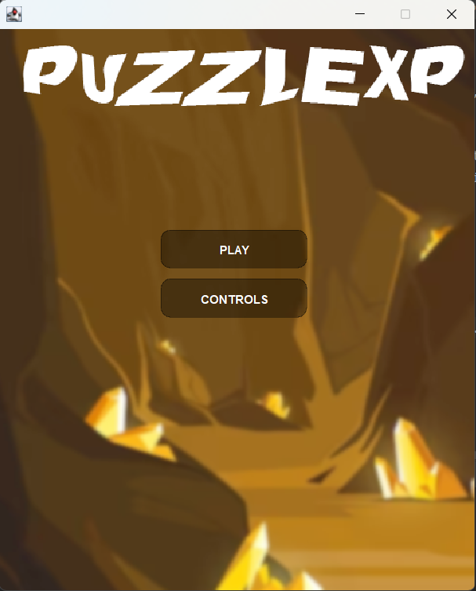
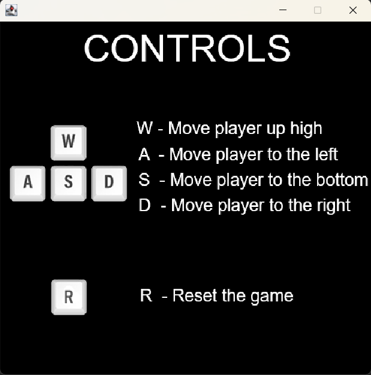
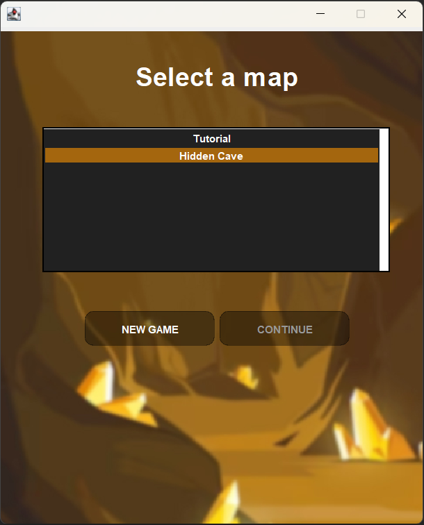
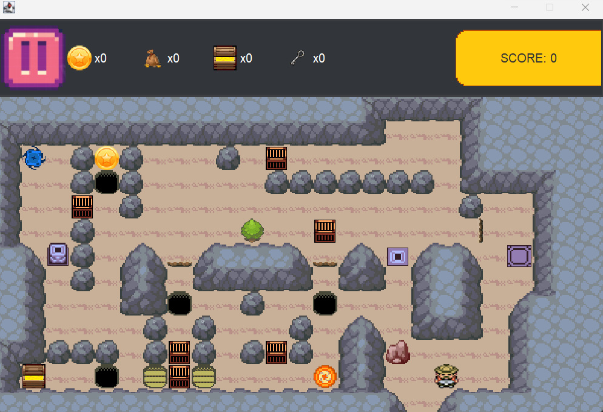
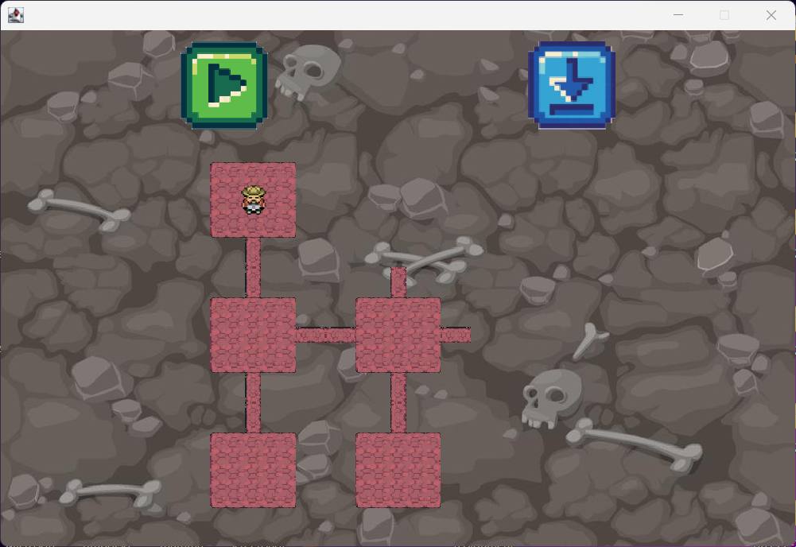
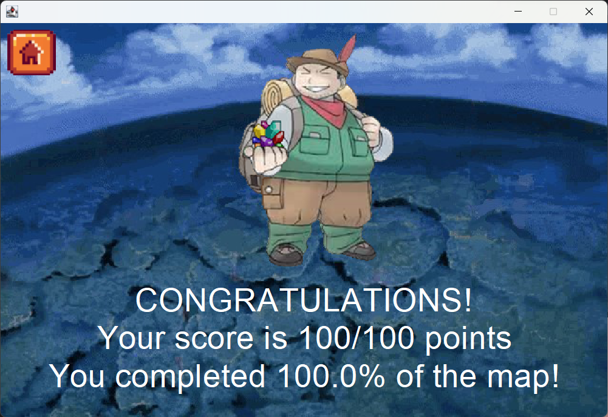

# Implementazione
In questa sezione ogni membro del gruppo illustrerà nel dettaglio alcune delle parti del sistema di sua competenza.
Inoltre sarà presente una sezione dedicata al codice sviluppato secondo la modalità pair programming e una dedicata alle
schermate di gioco.

## Sofia Tosi
Riporto di seguito un elenco di file raggruppati per package a cui ho lavorato totalmente, sono esclusi i file scritti in cooperazione con gli altri membri del team.
- controller
  - menu
    - ``` MenuController ```
- model
  - cell
    - logic
      - ``` ItemHolderExtension ```
      - ``` TreasureExtension ```
      - ``` UseItemExtension ```
    - traits
      - ``` Lock ```
      - ``` Plant ```
      - ``` Rock ```
    - ``` LockCell ```
    - ``` PlantCell ```
    - ``` RockCell ```
  - game
    - ``` ItemHolder ```
- utils
  - givens
    - ``` ItemConversion ```
  - extensions
    - paths
      - ``` WallPathExtractor ```
- view
  - menu
    - ``` ControlsView ```
    - ``` CustomCellRenderer ```
    - ``` CustomScrollBarUI ```
    - ``` ForegroundElements ```
    - ``` MenuView ```
    - ``` SelectMapExtension ```
    - ``` TransparentButton ```
      
Ripoterò di seguito una descrizione più approfondita degli aspetti implementativi più importanti, non trattati nei capitoli precedenti.

### RockCell e PlantCell
``` RockCell ``` e ``` PlantCell ``` rappresentano due celle della mappa di gioco, la prima con una roccia e la seconda con un albero che impediscono al giocatore di attraversarle. Grazie a specifici power-up ottenuti esplorando la stanza, il giocatore è in grado di frantumare la roccia e abbattere l'albero in modo tale da poter attraversare le celle.
Gli elementi roccia e albero sono modellati con un mixin. Grazie a quest'ultimo ``` RockCell ``` e ``` PlantCell ``` possono estendere la classe atratta ``` Cell ``` e al tempo stesso ereditare i membri dei traìt rock e plant (quali, ad esempio, broken/cut che restituiscono un booleano che permette di indicare se la roccia e la pianta sono rotte/tagliate) in modo molto flessibile. Infatti, un mixin rende il codice estremamente riutilizzabile, evitando la fragilità dell’ereditarietà utilizzata in ambiti di pura programmazione ad oggetti dove una modifica alla classe base può introdurre bug all’intera gerarchia.

### LockCell
In modo analogo a ``` RockCell ``` e ``` PlantCell ``` anche ``` LockCell ``` eredita campi e metodi dal corrispettivo Mixin.
I tre tipi di celle citate concretizzano il mixin attraverso una case class che garantisce immutabilità e permette di evitare side effects indesiderati. Inoltre, otteniamo getter, setter, toString, equals e hashCode dei parametri specificati. È stato molto utilizzato anche il metodo copy che permette di ottenere una nuova istanza della classe con alcuni campi modificati.

### ItemHolder
Una parte di rilievo è il metodo removeItem nella classe ItemHolder. Difatti in esso viene utilizzato un for comprehension per iterare sugli elementi della lista itemOwned e sui relativi indici. Lo yield permette di ottenere una nuova lista i cui elementi sono diversi da quello in input oppure sono uguali ma non sono la prima occorrenza.  Grazie al for comprehension operazioni complesse possono essere espresse in modo più leggibile e dichiarativo. Viene inoltre usato il metodo copy per creare una nuova istanza di ``` ItemHolder ```, essendo esso immutabile, e ciò risulta possibile in quanto è implementato tramite una case class.

### UseItemExtension, TreasureExtension, ItemHolderExtension
``` UseItemExtension ```, ``` TreasureExtension ```, ``` ItemHolderExtension ``` sono tre file che aggiungono metodi aggiuntivi alla classe base. I metodi sono incapsulati nell’omonimo oggetto, il quale viene importato al momento dell’uso. Grazie a questi extension methods il codice della classe base rimane inalterato e può usufruire delle feature aggiuntive. Questo pattern promuove il principio DRY in quanto permette di astrarre i concetti comuni e di riutilizzare il codice senza doverlo ripetere.
In particolare, nell’estensione ``` ItemHolder ``` vengono ridefiniti dei metodi come DSL. Grazie infatti all’utilizzo di alias, è possibile far sì che il metodo risulti più leggibile ed espressivo al momento della chiamata. Il nome del metodo è inoltre più significativo e coinciso. Riporto un esempio:
```scala
    /** Alias for [[ItemHolder.addItems()]] */
    @targetName("addItemsAlias")
    def ++(items: List[Item]): ItemHolder = itemHolder.addItems(items)

    /** Alias for [[ItemHolder.addItem()]] */
    @targetName("addItemAlias")
    def +(items: Item): ItemHolder = itemHolder.addItem(items)

    /** Alias for [[ItemHolder.removeItem()]] */
    @targetName("removeItemAlias")
    def -(item: Item): ItemHolder = itemHolder.removeItem(item)
```
Di seguito si riporta un test:
```scala
"an item holder" should "be able to show its items" in {
    (itemHolder
      + Item.Axe
      ++ List(Item.Key, Item.Pick)
      - Item.Key).itemHolderToString() should be(
      "[ AXE | PICK ]"
    )
  }
````
Si noti come risulti più espressivo e sia subito chiaro l’intento: ++ per aggiungere una lista di elementi, + per aggiungerne uno e – per la rimozione.

### ItemConversion
In questo file sono implementate due conversioni riguardanti gli item. La prima ha come output un int che rappresenta il valore in termini di punti dell’item mentre l’altra ha una stringa che rappresenta l’item in una rappresentazione testuale. Grazie al meccanismo given la conversione tra item e l’output specificato avviene in modo automatico.

### MenuController
Il metodo searchMapFile permette di ottenere una listmap immutabile contenente come chiave i nomi delle mappe e come valore il nome dei file. È implementato con un for comprehension per iterare sulla lista delle mappe. L’utilizzo di questo costrutto permette al codice di essere più leggibile e dichiarativo. 

### GameView, ForegroungElements
La creazione della GUI del gioco è realizzata tramite un for comprehension che ciclando sulle righe e sulle colonne permette di costruire una listMap immutabile avente come chiave la posizione della cella e come valore viene creato il tile corrispondente. Nelle prime due righe della classe vengono richiamati due metodi dell’oggetto ``` ToolbarElements ```. Essendo metodi utilizzati solo nel package game le due label hanno come modificatore d’accesso private[game] che restringe la visibilità dei metodi: sono visibili solo all’interno del package. Anche il file ``` ForegroundElements ``` ha dei metodi richiamati solo in ``` SelectMapExtension ```. Per questo motivo il modificatore di accesso è private[menu], per ridurre la visibilità dei metodi al solo package menu. Gli ultimi tre metodi in ``` ForegroundElements ``` vengono utilizzati nel file stesso e per questo motivo l’accesso è ristretto ulteriormente: sono private in modo tale che siano visibili solo all’oggetto in cui sono stati definiti.

### WallPathExtractor
Mi sono occupata della realizzazione di extractWallPath, metodo che si occupa di determinare se una specifica cella è un muro e in questa casistica che tipologia di muro è. Restituisce la stringa che specifica la tipologia del muro da aggiungere al path. Originariamente questo codice è stato scritto in Prolog. Tramite delle clausole filter si filtravano le celle che erano un muro (determinato dall’ultima proprietà del termine composto cella ``` c(_, _, _, wall) ``` ). Ottenute le celle muro adiacenti a quella da analizzare si controllava, con la seconda parte della teoria, a quale delle quattordici tipologie di muro appartenesse. In particolare si controllava quanti dei quattro angoli adiacenti (TopLeft, TopRight, BottomLeft, BottomRIght) fossero costituiti da tutte celle muro.
Tuttavia, non è stato possibile lasciare Prolog in questa parte, nonostante sia utile per verificare le quattordici regole sui muri tramite una logica “theorem prover”.
Il ``` PrologEngine ``` si è rivelato estremamente poco performante in questo approccio. Infatti, questa teoria veniva risolta per ogni cella della matrice 25x13, per un totale di 325 celle. Il tempo di caricamento della mappa calcolato tramite cronometro è risultato 15.82 secondi.
Il gioco è pensato per renderizzare le celle della mappa ogni volta che riceve un input. Quindi ad ogni mossa dell’utente il giocatore prima di muoversi aspettava più di 15 secondi. Il gioco è risultato ingiocabile. 
Una possibile soluzione trovata è stata quella di caricare le celle di tutte le mappe una sola volta all’inizio del gioco per avere un delay solamente a inizio partita, evitando un delay nel mezzo del gioco grazie a una schermata iniziale di loading. Tuttavia, nemmeno questa soluzione è risultata accettabile. Infatti caricando tutte le celle all’inizio il tempo del loading risultava 15.82 secondi * 9 stanze / 60 circa due minuti e 40. Si è ritenuto che il tempo calcolato fosse inaccettabile anche per una schermata di caricamento.
Come soluzione definitiva si è presa la decisione di trascrivere il codice Prolog in Scala che è in grado di ottenere il risultato desiderato in modo molto più performante delle precedenti casistiche. In particolare in questo codice è presente un for comprehension che  permette di ottenere una mappa immutabile avente come chiave le celle adiacenti e come valore un booleano che indica se sono ``` WallCell ``` oppure no in un modo dichiarativo e coinciso.

### Testing
Seguendo un approccio TDD, sono stati effettuati degli unit test per testare le funzionalità del core. In particolare le funzionalità del model testate sono:
- stato iniziale del lucchetto, della pianta e della roccia
- modalità di interazione delle celle lucchetto, pianta, roccia con il relativo item
- non chiudibilità del lucchetto
- interazione della pianta e della roccia con l'item cassa
- camminabilità del lucchetto, della pianta e della roccia
- le operazioni effettuabili con un itemHolder e corrispettiva rappresentazione testuale
- estrazione del path di una cella per il calcolo della corrispondente immagine

Per quando riguarda la parte della view non sono stati effettuati unit test in quanto il codice implementato non risulta automatizzabile: in alcune parti del codice sviluppato troviamo metodi di configurazione dei componenti Swing, la loro aggiunta ai JPanel, mentre in altre è richiesta l'interazione dell'utente con la GUI come la pressione di un pulsante o la selezione di un file.

## Serafino Pandolfini
Nel corso dello sviluppo di questo progetto mi sono occupato dei seguenti aspetti:
### Cell, BasicCell, WallCell
`Cell` rappresenta l'elemento base di cui è composta una `Room`.
La classe è implementata come abstract class offrendo un implementazione comune per i metodi ```walkableState```, che
ritorna _Walkable(true)_, e `isDeadly`, che ritorna _false_,  e al contempo descrive le proprietà comuni delle celle
quali `position` e `cellItem`. <br>
Al suo interno è definito l'**alias type** `Position` che descrive una tupla _(int, int)_, utilizzato per definire la
posizione di ogni cella nella loro stanza. <br>
Infine `Cell` è provvista di un **companion object** che fornisce tramite **given** un ordering per le celle basato 
sulla loro posizione per righe.

`BasicCell` e `WallCell` sono **case class** che estendono `Cell` e rappresentano i due tipi più comuni di
celle: la prima riproduce il comportamento di Cell senza modifiche mentre la seconda fornisce nuove implementazioni per
i metodi cellItem e walkableState ereditati da Cell.

### HoleCell, CoveredHoleCell
`HoleCell` e `CoveredHoleCell` sono altre tipologie di celle, a differenza di BasicCell e WallCell viene fatto
uso di **Mixin**: viene usato il mixin `Hole` per HoleCell e CoveredHoleCell e `Covered` per CoveredHoleCell. 
I mixin utilizzati permettono di aggiungere funzionalità specifiche senza creare una gerarchia complicata di classi. <br>
Viene in seguito riportato un esempio del mixin Hole:

```scala
/** The mixin representing an obstacle that is walkable and deadly, but can be filled with a box item */
trait Hole extends Cell:
  /** if the hole is filled */
  def filled: Boolean

  abstract override def isDeadly: Boolean = !filled || super.isDeadly
```


### TeleportCell, TeleportDestinationCell

### PrologEngine

### Room, RoomLink, RoomBuilder

### RoomRules

### Minimap

### PathExtractor


## Laura Leonardi

Il codice sviluppato in questo progetto ha principalmente riguardato gli ambiti di seguito riportati

### Celle
Di seguito sono elencate le celle sviluppate e i relativi **trait** ed **enumerazioni** utilizzati nella loro creazione, che hanno permesso di ottenere una migliore riusabilità del codice:
- `CliffCell` questa cella è stata programmata con l'aiuto dell'**enum** `Direction`
- `ButtonCell` i cui colori sono gestiti con l'aiuto dell'**enum** `Color` e del **trait** `Colorable`, mentre lo stato di pressione è gestito grazie all'**enum** `PressableState` e al **trait** `Pressable`
- `ButtonBlockCell` analogamente a `ButtonCell` fa uso di `Color`, `Colorable` e `ButtonBlock`, che a sua volta fa uso di `PressableState`e `Pressable`
- `PressurePlateCell` analogamente alle celle soprastanti fa uso di `PressableState` e `Pressable`
- `PressurePlateBlockCell` similmente a `PressurePlateCell` utilizza `PressableState` e `Pressable` tramite `PressurePlateBockGroup`

Ogni cella infatti è stata pensata come un **mixin** che fa uso di `Cell` come classe di base, a cui aggiunge diversi **trait** in base alle sue necessità. Inoltre ogni cella è stata implementata come **case class**.
Per quanto riguarda la gestione della logica relativa al comportamento delle celle è stato creato il file `CellExtension`, contenente **extension methods** utili a tale scopo.
Inoltre è stato sviluppato codice prolog, nello specifico le regole `search_button_block`, riportata nel'esempio sottostante, e `search_teleport_destination`, con lo scopo di ottenere le celle con determinate caratteristiche presenti nella stanza per poter eseguire poi operazioni su di esse.
```prolog
  %search_button_block( +L, -X, -Y, @C) filter the specified list and returns the coordinates of the button blocks of a specified color
  search_button_block([], [], [], C).
  search_button_block([c(bb, X1, Y1, C) | T], [X1 | T2], [Y1 | T3],  C) :- !, search_button_block(T, T2, T3, C).
  search_button_block([_ | T], X, Y, C) :- search_button_block(T, X, Y, C).
```
Si può notare come nel commento siano presenti indicazioni riguardo agli argomenti in output(-), in input(+), e in input di tipo **ground**(@)

### Mappe di gioco
È stata realizzata la classe `GameMap` per gestire la struttura delle varie mappe di gioco. Tale classe è dotata di svariati metodi, che gestiscono, per esempio, la restituzione di una stanza conoscendone il nome, il calcolo del punteggio totale ottenibile dalla mappa, o la gestione del passaggio tra due stanze presenti al suo interno.
Tali metodi, due dei quali sono riportati nell'esempio sottostante, fanno uso della **monade Try** per gestire le casistiche di errore, combinata con l'uso di **for comprehension** per permettere una gestione più pulita delle varie casistiche di fallimento, evitando di appesantire il codice con **match case** innestati.
```scala
    /** get the room from it's name
     * @param roomName
     *   the name of the room to be returned
     * @return
     *   the room or an error if the roomName is not present
     */
    def getRoomFromName(roomName: String): Try[Room] =
      Try(rooms.find(_.name == roomName) match
        case Some(value) => value.createCopy()
        case _           => throw new RoomNotFoundException
      )
    /** try to change the room
     * @param position
     *   the position in the previous room
     * @param roomName
     *   the previous room name
     * @return
     *   retrieve the tuple of next room and initial position if found, else an error
     */
    def changeRoom(position: Position, roomName: String, direction: Direction): Try[(Room, Position)] =
      for
        room <- getRoomFromName(roomName)
        link <- Try(
          room.links.find(_.from == position).filter(_.direction == direction).getOrElse(throw new LinkNotFoundException)
        )
        toRoom <- getRoomFromName(link.toRoom)
      yield (toRoom.createCopy(), link.to)
```
### Serializzazione
La serializzazione di classi in file di formato **Json** è stata gestita tramite la libreria io.circe, una libreria Scala pensata per la serializzazione e deserializzazione di file in formato Json.
Nello specifico tale serializzazione riguarda le mappe, e di conseguenza le celle e le stanze, e i file di salvataggio.
Il codice riguardante la serializzazione e deserializzazione si trova negli **object** `JsonDecoder`, `JsonCellDecoder`, `JsonEncoder`, e`JsonCellEncoder`. Tale separazione del codice relativo alle celle è stata effettuata poiché il loro numero elevato inficiava la leggibilità del codice, permettendo inoltre di separare logicamente la gestione delle celle, elementi fondanti dell'architettura.
Grazie all'utilizzo di circe le **case class** sono state serializzate e deserializzate automaticamente. Alcuni esempi più articolati sono riportati in seguito.
```scala
  given mapEncoder: Encoder[GameMap] = Encoder.instance(map =>
    Json.obj(
      MapName -> map.name.asJson,
      MapRooms -> map.rooms.map(r => roomEncoder.apply(r)).asJson,
      MapInitialRoom -> map.initialRoom.asJson,
      MapInitialPosition -> map.initialPosition.asJson
    )
  )
```
Il codice soprastante riguarda la codifica in Json delle informazioni riguardanti una `GameMap` mentre il codice sottostante riguarda il recupero di tali informazioni.
```scala
  given mapDecoder: Decoder[GameMap] = Decoder.instance(cursor =>
    for
      name <- cursor.downField(MapName).as[String]
      rooms <- cursor.downField(MapRooms).as[Set[Room]]
      initialRoom <- cursor.downField(MapInitialRoom).as[String]
      initialPosition <- cursor.downField(MapInitialPosition).as[Position]
    yield GameMap(name, rooms, initialRoom, initialPosition)
  )
```
In seguito è parzialmente riportato un esempio di file **Json** prodotto riguardante una mappa
```json
{
"name" : "testMap",
"rooms" : [
{
"name" : "TestRoom1",
"cells" : [
{
"cellType" : "ButtonBlockCell",
"position" : [
16,
9
],
"cellItem" : {
"Empty" : {

}
},
"color" : {
"Blue" : {

}
},
"pressableState" : {
"NotPressed" : {

}
}
},
{
"cellType" : "ButtonCell",
"position" : [
16,
5
],
"cellItem" : {
"Empty" : {

}
},
"color" : {
"Blue" : {

}
},
"pressableState" : {
"NotPressed" : {

}
}
},
...
],
"links" : [
{
"from" : [
0,
3
],
"direction" : {
"Left" : {

}
},
"toRoom" : "TestRoom2",
"to" : [
24,
3
]
}
]
},
{
"name" : "TestRoom2",
"cells" : [
{
"cellType" : "BasicCell",
"position" : [
12,
3
],
"cellItem" : {
"Empty" : {

}
}
},
...
],
"links" : [
{
"from" : [
24,
3
],
"direction" : {
"Right" : {

}
},
"toRoom" : "TestRoom1",
"to" : [
0,
3
]
}
]
}
],
"initialRoom" : "TestRoom1",
"initialPosition" : [
1,
1
]
}
```
### Gestione gioco

### Gestione schermate di pausa e di fine gioco

## Pair programming
### Sviluppato da Pandolfini Serafino e Leonardi Laura
La parte di codice sviluppato in pair programming riguarda il salvataggio del gioco.
Il salvataggio è stato gestito tramite gli object `GameController`,`GameView`, `CurrentGame`, e tramite il package `serialization`.
Per ogni mappa è possibile creare un salvataggio, le cui informazioni cardine saranno memorizzate tramite file `Json` e salvate in una apposita cartella nel dispositivo dell'utente.
Tali informazioni saranno poi recuperate per permettere al giocatore di riprendere il gioco a partire dal salvataggio effettuato.
A seguito il codice utilizzato per decodificare le informazioni necessarie al caricamento di un salvataggio
```scala
  given saveGameDecoder: Decoder[SaveData] = Decoder.instance(cursor =>
    for
      originalMap <- cursor.downField(SaveMapName).as[String]
      currentMap <- cursor.downField(SaveMap).as[GameMap]
      currentRoom <- cursor.downField(SaveRoom).as[Room]
      currentPlayerPosition <- cursor.downField(SaveCurrentPosition).as[Position]
      startPlayerPosition <- cursor.downField(SaveStartPosition).as[Position]
      itemList <- cursor.downField(SaveItems).as[List[Item]]
      score <- cursor.downField(SaveScore).as[Int]
      minimap <- cursor.downField(SaveMiniMap).as[List[MinimapElement]]
    yield (
      JsonDirectoryPath + originalMap + JsonExtension,
      currentMap,
      currentRoom,
      currentPlayerPosition,
      startPlayerPosition,
      itemList,
      score,
      minimap
    )
  )
```
### Sviluppato da Sofia Tosi e Serafino Pandolfini
Il lavoro svolto in collaborazione è relativo al package `view`  nelle classi `GameView` e `MultiLayeredTile`.
GameView definisce i layout che compongono la schermata di gioco e la `toolbar`. 
La schermata di gioco è stata realizzata a partire da un gridLayout di `MultiLayeredTile` di cui ognuno rappresenta una
cella della stanza attuale. La toolbar è composta da una serie di pulsanti e label che riflettono lo stato dell'`ItemHolder`.

Per queste classi sono stati utilizzati **For Comprehension** per la gestione dei tiles e degli elementi della toolbar; e 
**Extension Methods** nell'object `ViewUpdater` per separare in modo efficacie la creazione della GUI e il suo aggiornamento.

A seguito viene presentato un Extension Method per aggiornare i tiles con le immagini che riflettano la stanza corrente.
```scala
    /** associate the [[MultiLayeredTile]]s with their respective images
      * @param zippedPaths
      *   the paths for representing [[Cell]]s and [[Item]]s
      */
    def associateTiles(zippedPaths: List[(String, String)]): Unit =
      view.tiles =
        view.tiles.keys.zip(zippedPaths).foldLeft(view.tiles) { case (tilesMap, ((x, y), (groundPath, itemPath))) =>
          val updatedTile = tilesMap((x, y))
          updatedTile.itemImage = Option(getCellImage(itemPath))
          updatedTile.cellImage = Option(getCellImage(groundPath))
          tilesMap.updated((x, y), updatedTile)
        }
```


## Schermata di gioco
A seguire sono mostrate alcune immagini ottenute durante l'esperienza di gioco
<p align="center">
  
<caption>Menù iniziale</caption>
</p>
<p align="center">
  
<caption>Controlli utilizzabili dall'utente</caption>
</p>
<p align="center">
  
<caption>Selezione mappa</caption>
</p>
<p align="center">
  
<caption>Stanza di gioco</caption>
</p>
<p align="center">
  
<caption>Schermata di pausa</caption>
</p>
<p align="center">
  
<caption>Schermata di fine gioco</caption>
</p>

[Torna all'indice](../report.md) | [Vai a Retrospettiva](../07-retrospective/report.md)
